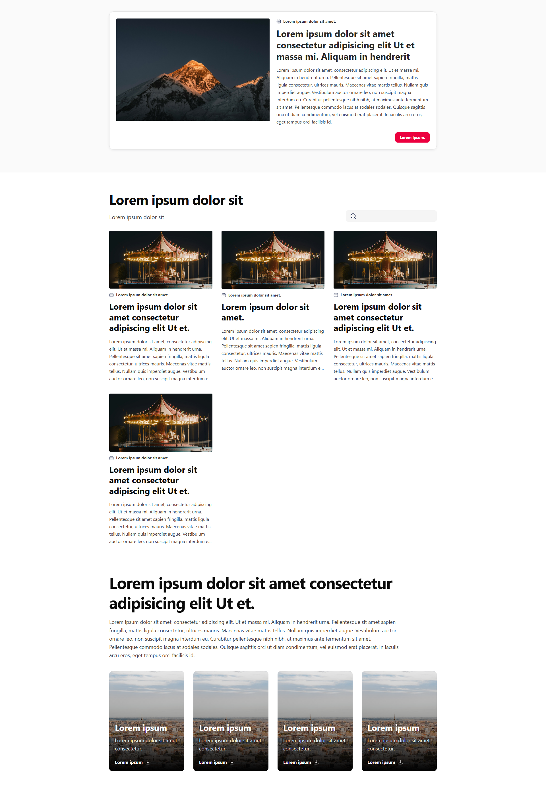
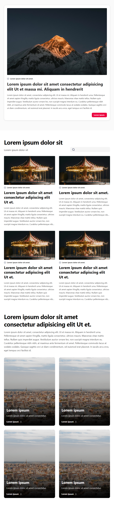
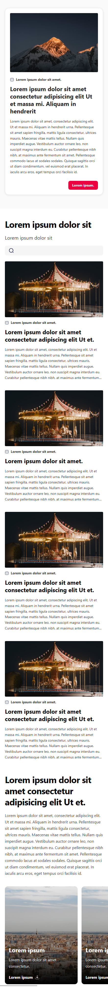

# Mindata Challenge

Implementación de una landing responsive en Angular basada en un diseño de referencia, con enfoque mobile first y componentes reutilizables.

## Stack

- Angular 21
- TypeScript
- Tailwind CSS v4
- Vitest
- `pnpm` como package manager

## Arquitectura

El proyecto está organizado con una separación simple entre `features` y `shared`:

```text
src/app/
  app.config.ts
  app.routes.ts
  features/
    home/
      home.ts
      home.html
      home.css
      home.data.ts
  shared/
    components/
      hero-card/
      article-card/
      feature-card/
      search-input/
```

### Criterio general

- `features/home/`: compone la página principal y define el layout de las secciones.
- `shared/components/`: contiene piezas visuales reutilizables y aisladas.
- `home.data.ts`: centraliza los mocks usados para renderizar la pantalla.
- `public/`: contiene imágenes e íconos estáticos usados por la UI.

### Decisiones de implementación

- Componentes standalone.
- `ChangeDetectionStrategy.OnPush`.
- Inputs tipados con la API moderna de Angular (`input.required()`).
- Maquetación mobile first con utilidades de Tailwind.
- HTML semántico y foco en accesibilidad base.

## Cómo levantar el proyecto

### Requisitos

- Node.js 20+ recomendado
- `pnpm`

### Instalación

```bash
pnpm install
```

### Desarrollo

```bash
pnpm start
```

Luego abrir:

```text
http://localhost:4200/
```

### Build

```bash
pnpm build
```

### Tests

```bash
pnpm test
```

## Implementación

### Desktop



### Tablet



### Mobile



## Notas

- El proyecto prioriza maquetación, responsividad y composición de componentes.
- La búsqueda es solo presentacional por ahora; no implementa lógica funcional.
